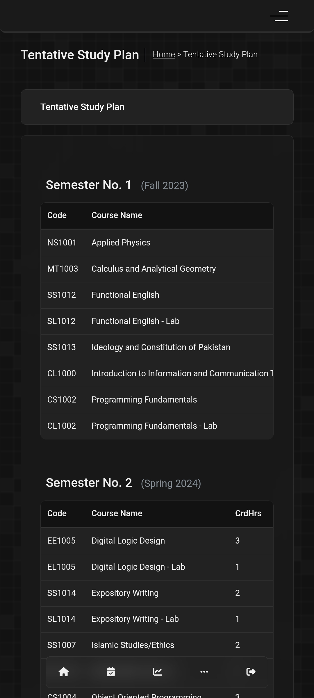
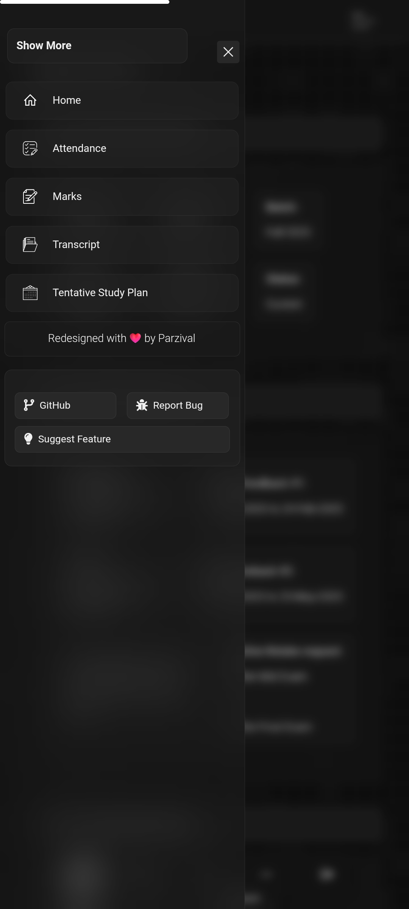
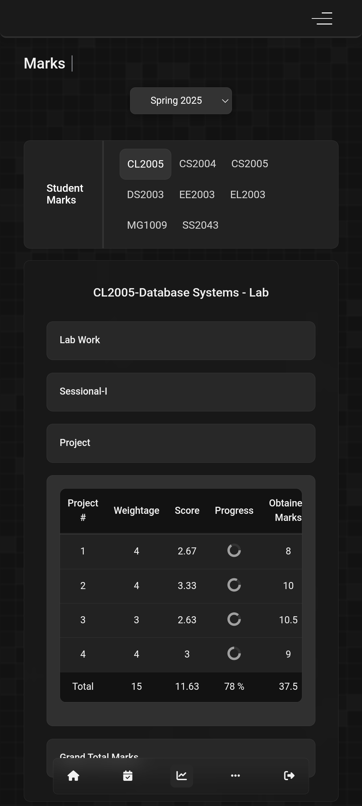

# 📱 Flex Portal WebView App (Custom Android Wrapper)

This is a lightweight, student-focused Android app built using **Android Studio**. It wraps the university's **Flex web portal** inside a secure `WebView`, with **custom-injected JavaScript and CSS** to significantly improve usability, layout clarity, and mobile responsiveness.

---

## 🎯 Purpose

Most university portals are not optimized for mobile users. This app aims to solve that by providing:
- A smooth mobile experience
- Quick access to key Flex features
- A distraction-free and readable UI
- Personalized styling and layout fixes

---

## 🚀 Features

- 🌐 **WebView-based** wrapper for the official university Flex system
- 🎨 **Custom CSS** to improve interface layout, font scaling, spacing, and theming
- 📜 **JavaScript injection** to manipulate and simplify UI elements
- 🔒 Secure login using the actual Flex login system (no credential storage)
- ⚡ Lightweight and fast — ideal for daily student use
- 📁 Includes modular JS for different portal sections (marks, fees, attendance, etc.)

---

## 🛠️ Technologies Used

- Java (Android Studio)
- Android `WebView`
- JavaScript injection (`addJavascriptInterface`)
- Custom `assets/*.js` scripts
- Android XML layouts
- Gradle + APK output

---

## 🗂️ Folder Structure Overview

```
Flex2/
├── app/
│   ├── release/                      # Final release APK
│   ├── src/
│   │   ├── main/
│   │   │   ├── assets/               # Injected JS files
│   │   │   ├── res/                  # Drawable, layout, values, etc.
│   │   │   ├── java/...              # MainActivity.java
│   │   │   └── AndroidManifest.xml
│   └── build.gradle
├── README.md
```

---

## 🧠 Injected JavaScript Modules

Located in `app/src/main/assets/`:
- `marks.js` – highlights grade entries
- `attendance.js` – cleans attendance layout
- `fee.js` – simplifies fee breakdown
- `home.js`, `log_in.js`, `side_nav_style.js` – base UI fixes and navigation tweaks
- `feedback.js`, `studyPlan.js`, `transcript.js`, etc. – section-specific enhancements

---

## 📦 APK Build

The release APK is built and located at:
```
/app/release/app-release.apk
```

You can install this on your phone by enabling "Install unknown apps" in settings.

> This is a personal build using official Flex URLs — login and data remain secure via the portal itself.

---

## 🧑‍🎓 Author

**Farhan Zafar**  
🔗 GitHub: [@FarhanZafarr-9](https://github.com/FarhanZafarr-9)

---

## 🛡️ Disclaimer

This project is a **personal tool** meant for improving user experience. It is **not affiliated** with the official university IT department or Flex development team.  
No credentials or user data are stored locally or externally. Everything is securely handled via the embedded Flex system itself.

---

## 📝 Future Plans (Optional Enhancements)

- Add light mode toggle
- Add offline access for schedules
- Cache frequently accessed pages

---

## 📷 Screenshots






---

## 📌 License

This repository is open-source and intended for personal or educational use.
